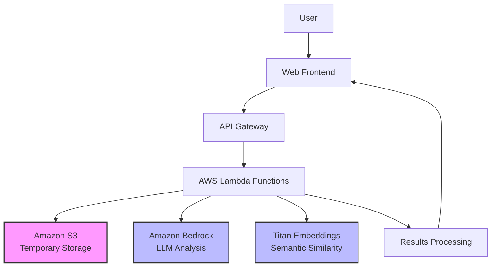

# Design Document: TraceAI Attribution Honesty System

## System Overview

TraceAI is an educational prototype designed to demonstrate transparent analysis of AI-generated content through paragraph-level attribution, originality indicators, and plagiarism risk assessment. Built for a student hackathon, the system prioritizes explainability and learning over production-grade accuracy.

**Target Users:**
- Students learning about AI content generation and attribution
- Developers exploring responsible AI practices
- Educators facilitating discussions about AI ethics and transparency

**Educational Focus:**
This prototype emphasizes understanding and transparency rather than definitive judgments. All scores and assessments are indicative and designed to promote learning about AI content analysis, not to provide legally binding or academically authoritative determinations.

## High-Level Architecture

**Flow Overview:**
1. User uploads document through web interface
2. Document temporarily stored in S3 with automatic cleanup
3. Lambda functions orchestrate analysis pipeline
4. Titan Embeddings calculate semantic similarity scores
5. Bedrock provides contextual explanations and insights
6. Results visualized with educational focus and clear limitations

**Simulated/Heuristic Components:**
- Originality scoring uses weighted heuristics rather than comprehensive databases
- Plagiarism risk assessment based on pattern analysis, not legal standards
- Attribution confidence levels are educational indicators, not definitive matches

## Core Components

### Frontend Interface
**Purpose:** Provide intuitive, educational user experience
- **Document Upload:** Drag-and-drop interface with format validation (PDF, DOCX, TXT)
- **Analysis Controls:** Adjustable sensitivity sliders to demonstrate how parameters affect results
- **Educational Tooltips:** Contextual explanations of metrics, limitations, and methodology
- **Interactive Visualization:** Paragraph-level highlighting with hover details and confidence indicators

### Document Manager
**Purpose:** Handle temporary document processing with privacy focus
- **Text Extraction:** Convert uploaded documents to analyzable text segments
- **Paragraph Segmentation:** Split content into logical analysis units
- **Temporary Storage:** S3 storage with 2-hour lifecycle policy for automatic cleanup
- **Privacy Protection:** No persistent storage of document content or user data

### Attribution Engine
**Purpose:** Demonstrate semantic similarity analysis using AWS AI services
- **Embedding Generation:** Use Titan Embeddings to create vector representations of text segments
- **Similarity Calculation:** Compare paragraph embeddings against reference knowledge patterns
- **Confidence Scoring:** Provide transparency about similarity confidence levels
- **Pattern Recognition:** Identify potential attribution relationships with clear uncertainty indicators

### Originality Scoring Module
**Purpose:** Provide educational indicators of content originality
- **Heuristic Calculation:** Weighted scoring based on semantic similarity patterns and text characteristics
- **Transparency:** Clear explanation of scoring methodology and limitations
- **Adjustable Thresholds:** Allow users to explore how different parameters affect scores
- **Educational Framing:** Emphasize learning value over absolute accuracy

### Plagiarism Risk Indicator
**Purpose:** Demonstrate risk assessment patterns for educational purposes
- **Pattern Analysis:** Analyze attribution clusters and similarity distributions
- **Risk Categorization:** Low/Medium/High indicators with clear disclaimers
- **Educational Recommendations:** Actionable suggestions for improving content attribution
- **Limitation Awareness:** Explicit communication about heuristic nature of assessments

### Results Visualizer
**Purpose:** Create engaging, educational presentation of analysis results
- **Interactive Highlighting:** Color-coded paragraph visualization with adjustable sensitivity
- **Methodology Explanation:** Clear documentation of how results were generated
- **Learning Report:** Focus on insights and recommendations rather than definitive scores
- **Limitation Communication:** Prominent display of system constraints and uncertainties

## Data Flow

### Step-by-Step Processing Pipeline

1. **Document Upload and Validation**
   - User selects document file through web interface
   - Frontend validates file type, size, and basic format requirements
   - Document uploaded to S3 with temporary lifecycle policy

2. **Text Extraction and Segmentation**
   - Lambda function retrieves document from S3
   - Extract plain text content using appropriate parsing libraries
   - Segment text into paragraph-level analysis units
   - Clean and normalize text for consistent processing

3. **Semantic Analysis with Titan Embeddings**
   - Generate embeddings for each text segment using Titan Embeddings
   - Calculate similarity scores against reference patterns
   - Identify potential attribution relationships with confidence levels
   - Store analysis metadata (not original content) for result generation

4. **LLM-Enhanced Analysis with Bedrock**
   - Use Amazon Bedrock to generate contextual explanations
   - Create educational insights about attribution patterns
   - Generate recommendations for improving content transparency
   - Provide methodology explanations in accessible language

5. **Scoring and Risk Assessment**
   - Calculate heuristic-based originality indicators
   - Assess plagiarism risk patterns using weighted algorithms
   - Generate confidence intervals and uncertainty indicators
   - Apply educational framing to all numerical results

6. **Results Compilation and Visualization**
   - Combine analysis results into comprehensive educational report
   - Generate interactive visualization data for frontend
   - Include methodology explanations and limitation disclaimers
   - Prepare downloadable learning-focused summary

7. **Cleanup and Privacy Protection**
   - Automatically delete original document from S3
   - Clear temporary processing data
   - Retain only anonymized performance metrics for system improvement

## AWS Services Used

### Amazon Bedrock
**Purpose:** LLM inference for explanations and contextual analysis
- **Educational Explanations:** Generate accessible descriptions of analysis methodology
- **Contextual Insights:** Provide meaningful interpretation of similarity patterns
- **Recommendation Generation:** Create actionable suggestions for users
- **Limitation Communication:** Help explain system constraints and uncertainties

### Titan Embeddings
**Purpose:** Semantic similarity computation for attribution analysis
- **Vector Generation:** Create high-quality embeddings for text segments
- **Similarity Calculation:** Enable meaningful comparison between text passages
- **Pattern Recognition:** Identify potential attribution relationships
- **Scalable Processing:** Handle multiple document segments efficiently

### AWS Lambda
**Purpose:** Orchestration and processing logic for serverless architecture
- **Document Processing:** Coordinate text extraction and segmentation
- **Analysis Pipeline:** Orchestrate calls to Bedrock and Titan services
- **Results Compilation:** Combine analysis outputs into coherent results
- **Error Handling:** Manage service limitations and provide graceful degradation

### Amazon S3
**Purpose:** Temporary document storage with automatic cleanup
- **Secure Upload:** Receive documents with appropriate access controls
- **Lifecycle Management:** Automatic deletion after 2 hours for privacy protection
- **Processing Storage:** Temporary workspace for document analysis pipeline
- **Cost Efficiency:** Pay-per-use storage appropriate for prototype scale

## Design Decisions and Trade-offs

### Heuristic-Based Scoring Approach
**Decision:** Use weighted algorithms rather than comprehensive plagiarism databases
**Rationale:** 
- Enables rapid prototyping within hackathon constraints
- Focuses on demonstrating methodology rather than claiming accuracy
- Allows for educational exploration of scoring parameters
- Avoids legal and ethical complexities of production plagiarism detection

### Indicative Rather Than Definitive Results
**Decision:** Frame all results as educational indicators with clear limitations
**Rationale:**
- Promotes responsible use of AI analysis tools
- Encourages critical thinking about automated content assessment
- Reduces risk of misuse for academic or legal decisions
- Aligns with educational objectives of transparency and learning

### Limited Scale and Persistence
**Decision:** Restrict to 5 concurrent users and 2-hour data retention
**Rationale:**
- Fits within AWS free tier and student account limitations
- Demonstrates privacy-by-design principles
- Focuses resources on core functionality rather than scalability
- Appropriate scope for hackathon demonstration

### AWS Service Integration Focus
**Decision:** Emphasize meaningful use of Bedrock and Titan rather than custom ML
**Rationale:**
- Demonstrates cloud-native AI application patterns
- Leverages state-of-the-art models without training overhead
- Shows practical integration of AWS generative AI services
- Enables focus on application logic rather than model development

## Limitations and Future Enhancements

### Current Prototype Limitations

**Language Support:**
- English text only due to embedding model constraints
- No support for multilingual documents or code analysis

**Scale and Performance:**
- Limited to 5MB documents and 5 concurrent users
- Processing time may vary based on AWS service availability
- No optimization for large-scale or production workloads

**Analysis Accuracy:**
- Heuristic-based scoring without comprehensive reference databases
- Semantic similarity may not reflect actual content relationships
- No integration with academic or legal plagiarism standards

**Security and Compliance:**
- Basic prototype-level security controls only
- No user authentication or persistent accounts
- Not suitable for handling sensitive or confidential documents

### Possible Future Enhancements

**Enhanced Analysis Capabilities:**
- Integration with academic databases and citation networks
- Support for code plagiarism detection and software similarity
- Multi-language support and cross-language attribution analysis
- Advanced ML models for more sophisticated pattern recognition

**Production-Grade Features:**
- User authentication and persistent analysis history
- Enterprise security controls and compliance frameworks
- Scalable architecture for institutional deployment
- API integration for learning management systems

**Educational Improvements:**
- Interactive tutorials on AI content analysis concepts
- Comparative analysis tools for understanding different approaches
- Integration with academic integrity curricula and training programs
- Collaborative features for classroom discussions and peer learning

### Ethical and Responsible AI Considerations

**Transparency Requirements:**
- Clear communication of system limitations and uncertainties
- Open documentation of analysis methodology and assumptions
- Regular updates to reflect evolving understanding of AI content analysis

**Bias and Fairness:**
- Recognition that semantic similarity models may contain training biases
- Acknowledgment that attribution patterns may vary across domains and writing styles
- Commitment to inclusive design that considers diverse academic and cultural contexts

**Educational Responsibility:**
- Emphasis on critical thinking rather than automated decision-making
- Promotion of understanding about AI capabilities and limitations
- Support for developing responsible AI usage practices among students and educators

## Correctness Properties

*A property is a characteristic or behavior that should hold true across all valid executions of a system—essentially, a formal statement about what the system should do. Properties serve as the bridge between human-readable specifications and machine-verifiable correctness guarantees.*

### Property 1: File Upload Validation and Storage
*For any* uploaded file, if it meets format (PDF, DOCX, TXT) and size (≤5MB) requirements, it should be accepted and stored in S3, while invalid files should be rejected with appropriate error messages
**Validates: Requirements 1.1, 1.2, 1.5**

### Property 2: Text Segmentation Consistency
*For any* valid text document, segmenting it into paragraphs should produce segments that, when concatenated, preserve the original content structure and meaning
**Validates: Requirements 1.3**

### Property 3: Semantic Similarity Calculation
*For any* text segment, the Attribution Engine should successfully call Titan Embeddings API and return similarity scores within valid ranges (0-1) with appropriate confidence indicators
**Validates: Requirements 2.1, 2.2**

### Property 4: Performance Bounds
*For any* document up to 3000 words, the complete analysis pipeline should complete within 90 seconds under normal AWS service conditions
**Validates: Requirements 2.4, 6.2**

### Property 5: Originality Score Validity
*For any* analyzed text segment, the Originality Scorer should produce scores within the valid range (0-100) and include appropriate educational disclaimers
**Validates: Requirements 3.1, 3.2**

### Property 6: Interactive Parameter Adjustment
*For any* analysis result, adjusting sensitivity thresholds or parameters should produce corresponding changes in scores and risk assessments while maintaining score validity
**Validates: Requirements 3.4, 4.4**

### Property 7: Risk Assessment Categorization
*For any* content analysis, the Plagiarism Detector should assign exactly one risk level (Low/Medium/High) with clear disclaimers about the educational nature of the assessment
**Validates: Requirements 4.1**

### Property 8: Results Visualization Completeness
*For any* completed analysis, the Results Visualizer should display paragraph-level highlights, provide interactive controls, and generate a downloadable report containing all analysis components
**Validates: Requirements 5.1, 5.2, 5.3, 5.4**

### Property 9: Concurrent User Handling
*For any* set of up to 5 simultaneous users, the system should process their documents concurrently without data corruption or significant performance degradation
**Validates: Requirements 6.1**

### Property 10: Document Privacy and Cleanup
*For any* uploaded document, it should be automatically deleted from S3 within 2 hours of processing completion, and no document content should appear in system logs or analysis records
**Validates: Requirements 7.1, 7.2, 7.5**

### Property 11: AWS Service Integration Reliability
*For any* system operation, calls to Amazon Bedrock and Titan Embeddings should include proper error handling, timeout management, and graceful degradation when services are unavailable
**Validates: Requirements 8.1, 8.2, 8.3**

## Error Handling

### AWS Service Failures
- **Bedrock Unavailability:** Graceful degradation with cached explanations and user notification
- **Titan Embeddings Timeout:** Fallback to simplified similarity calculations with clear limitations
- **Lambda Timeout:** Partial results delivery with processing status updates
- **S3 Access Issues:** Clear error messages with retry mechanisms

### Input Validation Errors
- **Invalid File Formats:** Educational error messages explaining supported formats and conversion options
- **Oversized Documents:** Guidance on document size limits with suggestions for content reduction
- **Corrupted Files:** Clear feedback about file integrity issues with troubleshooting tips

### Processing Limitations
- **Complex Document Structures:** Graceful handling of tables, images, and formatting with explanatory messages
- **Non-English Content:** Clear communication about language limitations with future enhancement suggestions
- **Rate Limiting:** User-friendly messages about temporary service limitations with estimated retry times

## Testing Strategy

### Dual Testing Approach
The TraceAI system requires both unit testing and property-based testing to ensure comprehensive coverage:

- **Unit tests** validate specific examples, edge cases, and error conditions
- **Property tests** verify universal properties across all inputs
- Together they provide comprehensive coverage where unit tests catch concrete bugs and property tests verify general correctness

### Property-Based Testing Configuration
- **Testing Library:** Use Hypothesis (Python) or fast-check (JavaScript/TypeScript) for property-based testing
- **Test Iterations:** Minimum 100 iterations per property test to ensure thorough randomized input coverage
- **Test Tagging:** Each property test must include a comment referencing its design document property
- **Tag Format:** `# Feature: trace-ai, Property {number}: {property_text}`

### Unit Testing Focus Areas
- **AWS Service Integration:** Mock service responses and test error handling paths
- **File Processing Edge Cases:** Test with various document formats, sizes, and corruption scenarios
- **UI Component Behavior:** Test interactive controls, visualization modes, and user feedback mechanisms
- **Privacy and Security:** Verify data cleanup, access controls, and information leakage prevention

### Integration Testing
- **End-to-End Workflows:** Test complete document processing pipelines with real AWS services
- **Performance Validation:** Measure actual processing times and concurrent user handling
- **Error Recovery:** Test system behavior under various failure conditions and service limitations